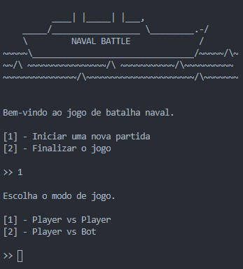
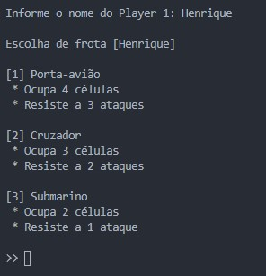
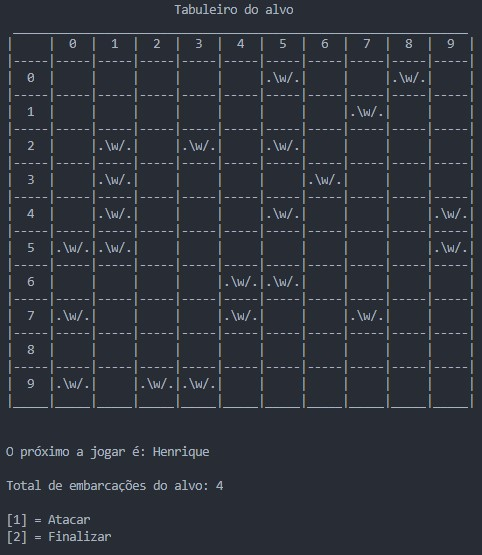
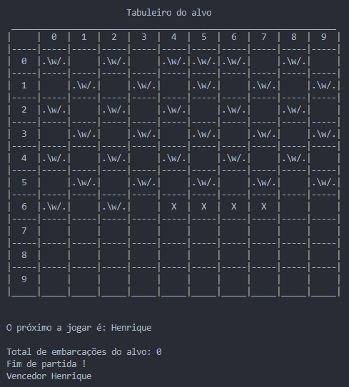

# Naval Battle

Este é o repositório da reconstrução do projeto final da disciplina de Algoritmo e Programação Estruturada feito utilizando python, 
fiz esse projeto na faculdade em 2018, diferentemente do projeto original esse projeto faz uso de classes, algumas estruturas de dados clássicas, modularização e funções. ou seja em resumo faz tudo que o projeto anterior fazia só que melhor e de forma mais eficiente.

## Características

Possúi 5 módulos: main.py, Escolha.py, Jogador.py,  Embarcacao.py, Partida.py, PosicionarFrota.py.

* main.py - Módulo principal, responsável por iniciar e finalizar o jogo e permite que o usuário escolha o modo de jogo, faz uso dos modulos Jogador.py, Escolha.py e Partida.py

  

* Escolha.py - Módulo que possúi apenas a função Escolha, a função escolha recebe uma variável booleana como argumento dependendo do
estado da variável a embarcação é escolhida automaticamente, caso não seja o caso é apresentado um menu interativo com o qual o usuário 
pode escolher a sua frota de embarcações, retorna um dicionário de dados contendo vetores que contem as embarcações escolhidas.

  
 
 * Jogador.py - Módulo que contem a classe Jogador, responsável por guardar a frota, numero de embarcoes, matrizes usadas durante o posicionamento e o jogo, string formada a partir da matriz do jogo, o tipo de jogador(player ou bot) e o nome do jogador.
 
 * Embarcacao.y - Módulo que contem a classe Embarcacao, responavel por armazenar o número de ataques recebidos por uma embarcação
 o maximo de ataques que uma embarcação pode receber dependendo do seu tipo, a quantidade de células do tabuleiro que a embarcação 
 ocupa, o seu tipo, se esta posicionada em um tabuleiro e as posiçoes que ocupa.
 
 * Partida.py - Módulo que contém a função responsável por dar andamento ao jogo em si, invoca variadas funções para dar andemento
 ao jogo.
 
    * Jogadas durante uma partida.
    
    
   
    * Finalização de uma partida.
    
    
   
 * PosicionarFrota.py - Módulo que contém funções responsáveis por posicionar a frota de um jogador em seus tabuleiro, apesar do seu
 objetivo ser simples sua criação foi a parte mais complexa do projeto tendo em vista as regras do jogo que são
 
    * As embarcações não devem estar em células adjacentes umas das outras
    * As embarcações devem estar posicionadas horizontalmente e verticalmente
    * Todas as embarcaçoes devem formar uma linha reta no tabuleiro
